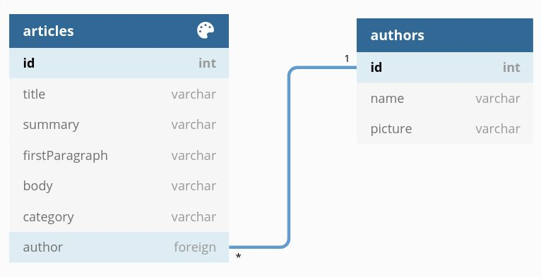

# Jungle Devs - Django Challenge #001

This is a simple backend application of a Django API with Token authentication, which allows for user sign-up and logins. It utilizes PostgresSQL to implement the following model:



Anonymous users may consume the API for most article and author data, but they cannot read the `body` field of articles.

```
/api/articles/
/api/articles/?category=:slug
```


Anonymous users may sign up via POST in order to login and retrieve an authentication token. Users logged in with an authentication token may create, read, update, and delete articles as well as authors.

```
/api/sign-up/
/api/login/
/api/admin/articles/
/api/admin/authors/
```

For more details on the endpoints, the API is documented with [drf-yasg](https://github.com/axnsan12/drf-yasg) and possesses a [Redocs](https://github.com/Redocly/redoc) endpoint.

```
/api/redoc/
```

If you use [Insomnia](https://insomnia.rest/download) for REST API development, check out [/docs/](./docs/) for importing and performing test requests.

## Launching the app in Development mode

To set up the application for development, follow these steps: 

1 - Clone the repository locally.
```bash
git clone https://github.com/lucasgcb/django-JD-challenge.git
```

2 - Install [Docker](https://docs.docker.com/get-docker/) and [Docker-Compose](https://docs.docker.com/compose/install/), if you don't have them.

3 - Enter the local repository
```bash
$ cd django-JD-challenge
```

4 - Set the environment variables on [docker-compose.yml](https://github.com/lucasgcb/django-JD-challenge/blob/main/docker-compose.yml#L18-L19). 
- Setting `DEBUG=1` will turn Django's debug mode, and `PYSVR=1` will allow for `manage.py`'s runserver option on http://localhost:8000
-  If `PYSVR=0`, Docker will launch Django behind gunicorn and whitenoise on http://localhost:8000 

5 - Run docker compose.
```bash
$ sudo docker-compose up
```

The development server should be running on http://localhost:8000 


## Launching the app in Production mode

To make sure the Docker application is production ready, go through the checklist:

- Double check the environment variables in [/env/](./env/). 
- [./env/db.env](./env/db.env) contains the db information for default database name, user, and password. Adjust these for your deployment needs.
- [./env/django.env](./env/django.env) contains sensitive Django information including secret key and Allowed hosts. Adjust these for your deployment needs.
- In [docker-compose.yml](https://github.com/lucasgcb/django-JD-challenge/blob/main/docker-compose.yml#L18-L19), set `PYSVR=0` so Docker will launch Django behind gunicorn and whitenoise and `DEBUG=0` to disable Django's debug mode.

After making sure the environment variables are set, simply boot docker-compose and the production build will be running on http://localhost:8000

```bash
$ sudo docker-compose up
```

## Description

**Challenge goal**: The purpose of this challenge is to give an overall understanding of a backend application. You’ll be implementing a simplified version of a news provider API. The concepts that you’re going to apply are:

- REST architecture;
- Authentication and permissions;
- Data modeling and migrations;
- PostgreSQL database;
- Query optimization;
- Serialization;
- Production builds (using Docker).

**Target level**: This is an all around challenge that cover both juniors and experience devs based on the depth of how the concepts were applied.

**Final accomplishment**: By the end of this challenge you’ll have a production ready API.

## Acceptance criteria

- Clear instructions on how to run the application in development mode
- Clear instructions on how to run the application in a Docker container for production
- A good API documentation or collection
- Login API: `/api/login/`
- Sign-up API: `/api/sign-up/`
- Administrator restricted APIs:
  - CRUD `/api/admin/authors/`
  - CRUD `/api/admin/articles/`
- List article endpoint `/api/articles/?category=:slug` with the following response:
```json
[
  {
    "id": "39df53da-542a-3518-9c19-3568e21644fe",
    "author": {
      "id": "2d460e48-a4fa-370b-a2d0-79f2f601988c",
      "name": "Author Name",
      "picture": "https://picture.url"
    },
    "category": "Category",
    "title": "Article title",
    "summary": "This is a summary of the article"
  },
  ...
]
```
- Article detail endpoint `/api/articles/:id/` with different responses for anonymous and logged users:

    **Anonymous**
    ```json
    {
      "id": "39df53da-542a-3518-9c19-3568e21644fe",
      "author": {
        "id": "2d460e48-a4fa-370b-a2d0-79f2f601988c",
        "name": "Author Name",
        "picture": "https://picture.url"
      },
      "category": "Category",
      "title": "Article title",
      "summary": "This is a summary of the article",
      "firstParagraph": "<p>This is the first paragraph of this article</p>"
    }
    ```

    **Logged user**
    ```json
    {
      "id": "39df53da-542a-3518-9c19-3568e21644fe",
      "author": {
        "id": "2d460e48-a4fa-370b-a2d0-79f2f601988c",
        "name": "Author Name",
        "picture": "https://picture.url"
      },
      "category": "Category",
      "title": "Article title",
      "summary": "This is a summary of the article",
      "firstParagraph": "<p>This is the first paragraph of this article</p>",
      "body": "<div><p>Second paragraph</p><p>Third paragraph</p></div>"
    }
    ```
